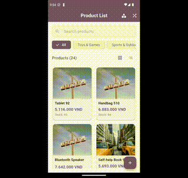

# Product Manager Demo

[](https://flutter.dev)
[](https://dart.dev)
[](LICENSE)
[](https://flutter.dev)

> 🇺🇸 [English](README.md) | 🇻🇳 [Tiếng Việt](README.vi.md)

## 🎥 Demos




## 📖 Overview

Flutter app for product management with offline-first architecture, real-time sync, and modern UI/UX, following Clean Architecture.

## ✨ Key Features

- **Category Management**: View, add, edit, delete categories; filter products by category.
- **Product Management**: List (grid/list), details, add/edit/delete; generate sample data.
- **Search**: By keyword, category; real-time results with notifications.
- **Image Upload**: Multi-image support from camera/gallery; preview, generate mock URLs.
- **Utilities**: Pull-to-refresh, view toggle, offline support, user-friendly error handling.
- **Mock API**: GET/POST/PUT/DELETE endpoints for products and categories via interceptor.

## 🛠️ Tech Stack

| Package | Version | Purpose |
|---------|---------|---------|
| flutter_bloc | ^9.1.1 | State management |
| get_it | ^8.1.0 | Dependency injection |
| injectable | ^2.3.2 | DI code generation |
| dio | ^5.8.0+1 | HTTP client |
| sqflite | ^2.4.2 | Local SQLite |
| flutter_screenutil | ^5.9.0 | Responsive UI |
| cached_network_image | ^3.4.1 | Image caching |
| flutter_cache_manager | ^3.4.1 | Cache management for cached_network_image |
| image_picker | ^1.0.4 | Image selection |
| http_mock_adapter | ^0.6.1 | Mock API with dio |
| intl | ^0.20.2 | Localization, currency formatting |
| equatable | ^2.0.7 | Value comparison |

## 🏗️ Architecture

```
lib/
├── domain/   # Entities, usecases, repository contracts
├── data/     # Models, repository impl, datasources
├── presentation/ # UI, Blocs, widgets
└── core/     # Services, utilities, interceptors
```

## 💾 Data Storage

- **SQLite**: Tables for Products, Categories.
- **JSON Files**: Mock API data: products.json, categories.json in app directory; sync with SQLite.
- **Images**: Local storage, mock URL generation, caching with flutter_cache_manager.

## 🚀 Getting Started

### Installation

1. Clone: `git clone https://github.com/nmtuong97/product_manager_demo.git && cd product_manager_demo`
2. Dependencies: `flutter pub get`
3. Generate code: `flutter packages pub run build_runner build`
4. Run: `flutter run`

## 📱 Screenshots

| List | Detail | Add/Edit |
|------|--------|----------|
|  |  |  |

## 📄 License

MIT License - see [LICENSE](LICENSE).

---
📘 [Tiếng Việt](README.vi.md)