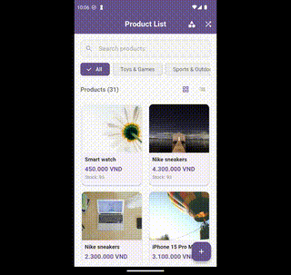
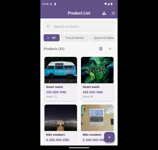
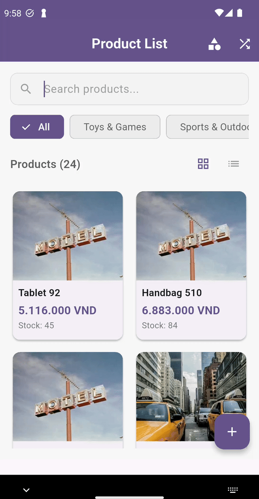
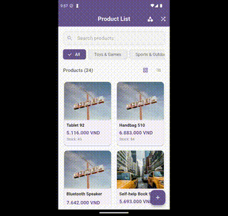

# Ứng Dụng Quản Lý Sản Phẩm

[](https://flutter.dev)
[](https://dart.dev)
[](LICENSE)
[](https://flutter.dev)

> 🇺🇸 [English](README.md) | 🇻🇳 Tiếng Việt

## 🎥 Demo










## 📖 Tổng Quan

Ứng dụng Flutter quản lý sản phẩm với kiến trúc offline-first, đồng bộ thời gian thực và UI/UX hiện đại, tuân thủ Clean Architecture.

## ✨ Tính Năng Chính

- **Quản Lý Danh Mục**: Hiển thị, thêm, sửa, xóa danh mục; lọc sản phẩm theo danh mục.
- **Quản Lý Sản Phẩm**: Danh sách (lưới/danh sách), chi tiết, thêm/sửa/xóa; tạo dữ liệu mẫu.
- **Tìm Kiếm**: Theo từ khóa, danh mục; kết quả thời gian thực với thông báo.
- **Tải Lên Ảnh**: Hỗ trợ nhiều ảnh từ máy ảnh/thư viện; xem trước, tạo URL giả lập.
- **Tiện Ích**: Kéo để làm mới, chuyển chế độ xem, hỗ trợ ngoại tuyến, xử lý lỗi thân thiện.
- **API Giả Lập**: Các endpoint GET/POST/PUT/DELETE cho sản phẩm và danh mục qua interceptor.

## 🛠️ Ngăn Xếp Công Nghệ

| Gói | Phiên Bản | Mục Đích |
|-----|-----------|----------|
| flutter_bloc | ^9.1.1 | Quản lý trạng thái |
| get_it | ^8.1.0 | Tiêm phụ thuộc |
| injectable | ^2.3.2 | Tạo mã DI |
| dio | ^5.8.0+1 | Client HTTP |
| sqflite | ^2.4.2 | SQLite cục bộ |
| flutter_screenutil | ^5.9.0 | UI responsive |
| cached_network_image | ^3.4.1 | Lưu đệm ảnh |
| flutter_cache_manager | ^3.4.1 | Quản lý bộ đệm cho cached_network_image |
| image_picker | ^1.0.4 | Chọn ảnh |
| http_mock_adapter | ^0.6.1 | API giả lập kết hợp với dio |
| intl | ^0.20.2 | Bản địa hóa, định dạng tiền tệ |
| equatable | ^2.0.7 | So sánh giá trị |

## 🏗️ Kiến Trúc

```
lib/
├── domain/   # Entities, usecase, repository contract
├── data/     # Models, repository impl, datasource
├── presentation/ # UI, Bloc, widget
└── core/     # Services, Utilities, interceptor
```

## 💾 Lưu Trữ Dữ Liệu

- **SQLite**: Bảng Products, Categories.
- **JSON Files**: Mock api data: products.json, categories.json trong thư mục ứng dụng; đồng bộ với SQLite.
- **Hình Ảnh**: Lưu cục bộ, tạo URL giả lập, lưu đệm với flutter_cache_manager.

## 🚀 Bắt Đầu

### Cài Đặt

1. Sao chép: `git clone https://github.com/nmtuong97/product_manager_demo.git && cd product_manager_demo`
2. Phụ thuộc: `flutter pub get`
3. Tạo mã: `flutter packages pub run build_runner build`
4. Chạy: `flutter run`

## 📄 Giấy Phép

MIT License - xem [LICENSE](LICENSE).

---
📘 [English](README.md)
